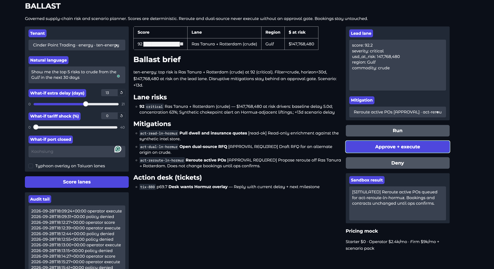
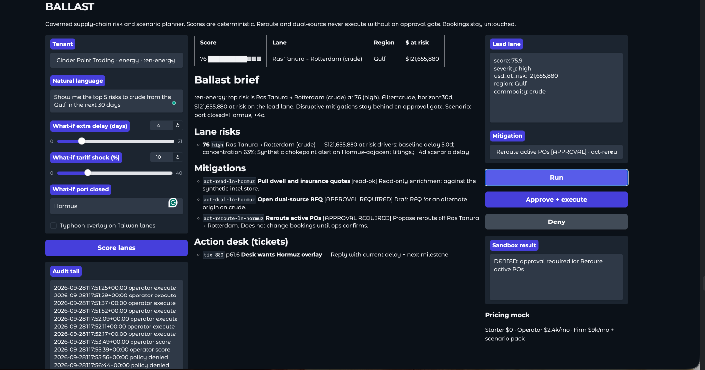
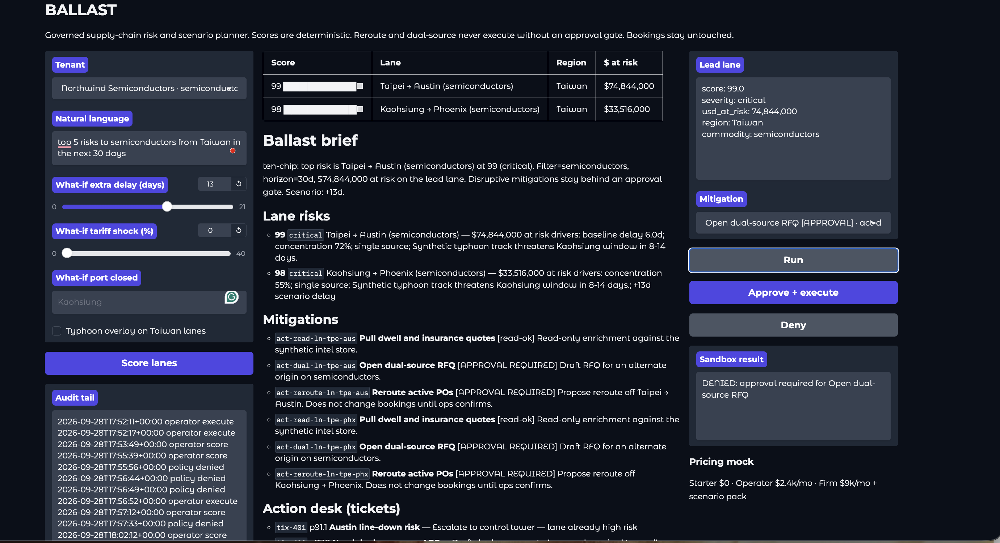
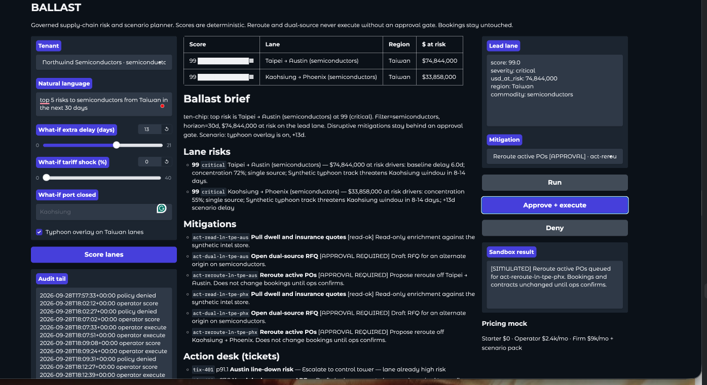

# BALLAST

Governed SaaS supply-chain risk and scenario planner.

Scores are deterministic. Dual-source and reroute never change bookings without an approval gate. The planner does not silently reroute the network.

Repo: https://github.com/TAM-DS/ballast

This is the operations twin of [Aegis Analyst](https://github.com/TAM-DS/aegis-analyst): same control pattern, different domain.

---

## Two surfaces, one engine

| Surface | User | Click |
| --- | --- | --- |
| Control tower | COO / risk / consulting | Lane heatmap, NL query, what-if sliders |
| Action desk | Support / ops | Tickets → prioritized actions |

Demo tenants: Northwind Semiconductors, Gulf Harvest Imports, Cinder Point Trading.

Default query:

`Show me the top 5 risks to semiconductors from Taiwan in the next 30 days`

Energy query:

`Show me the top 5 risks to crude from the Gulf in the next 30 days`

---

## Demo (four beats)

Two tenants. Each has a deny path and an ops-confirm path.









---

## Run

```bash
cd ballast
python3 -m venv .venv
source .venv/bin/activate
pip install -r requirements.txt
python app.py
```

Open http://127.0.0.1:7860

1. Tenant **Northwind Semiconductors** with the Taiwan query, or **Cinder Point Trading** with the Gulf crude query.
2. **Score lanes**.
3. Select **Reroute** or **Open dual-source RFQ** → **Run** → `DENIED`.
4. **Approve + execute** → `[SIMULATED] … Bookings and contracts unchanged until ops confirms.`
5. Move delay / tariff / port-closed / typhoon and score again.

```bash
python -m pytest tests/ -q
```

---

## What is in / what is not

**In:** multi-tenant mock, synthetic lanes/signals/tickets, deterministic risk, what-if scenario, NL filter parser, ticket desk, approval gate, audit, pricing mock.

**Not in (on purpose):** live AIS/news APIs, a trained time-series model, Stripe, LangGraph-for-show. The score is a transparent weighted model plus scenario shocks.

---

## Talk track

Aegis: isolate is gated. Ballast: reroute is gated. Tenant and question must match. Consulting gets a week-one risk engagement in a console. InCommodities gets Hormuz / crude overlays.

Portfolio system for Tracy Manning / TAM-DS.
